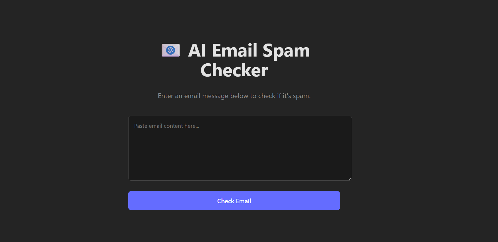
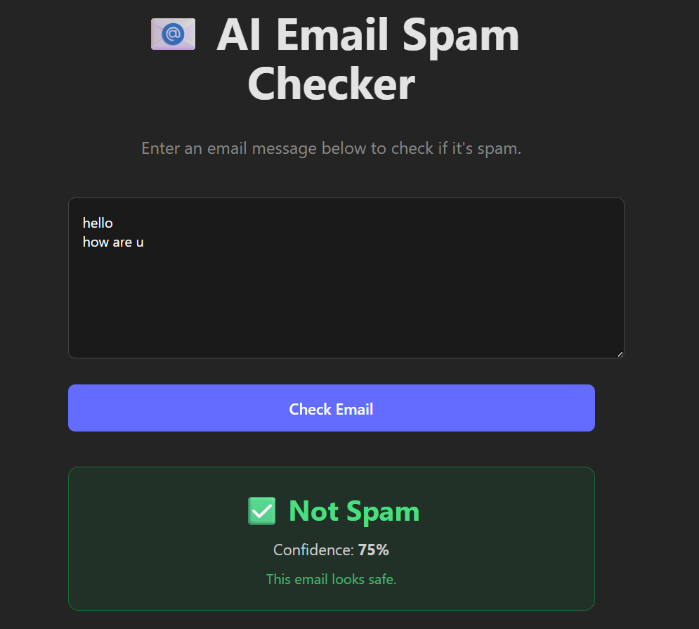

# 📧 AI Email Spam Checker

An AI-powered full-stack web application that detects whether an email message is Spam or Not Spam using a Machine Learning model trained with Natural Language Processing (NLP). The application features a modern React frontend connected to a Flask REST API for real-time predictions.

---

## ✨ Features

- 📧 Email Spam Detection
- 🤖 Machine Learning Classification
- 📝 NLP Text Processing
- ⚡ Real-time Predictions
- 🔗 Flask REST API
- 📊 Confidence Score
- 📱 Responsive UI
- 🚀 Fast React Frontend

---

# 📸 Screenshots

## Email Input



---

## Prediction Result



---

## 🛠 Tech Stack

### Frontend

- React.js
- Vite
- HTML
- CSS
- JavaScript

### Backend

- Python
- Flask

### Machine Learning

- Scikit-learn
- Pandas
- NumPy
- NLP (TF-IDF Vectorizer)

---

## 📂 Project Structure

```
AI_ML_EMAIL_CHECK
│
├── backend
│   ├── app.py
│   ├── train_model.py
│   ├── spam_model.pkl
│   ├── vectorizer.pkl
│   └── requirements.txt
│
├── frontend
│   ├── src
│   ├── public
│   └── package.json
│
├── screenshots
│   ├── home.png
│   └── result.png
│
└── README.md
```

---

## 🚀 Installation

Clone the repository

```bash
git clone https://github.com/ARADHYA200/AI_ML_EMAIL_CHECK.git
```

Backend

```bash
cd backend
pip install -r requirements.txt
python app.py
```

Frontend

```bash
cd frontend
npm install
npm run dev
```

---

## 📊 Model Capabilities

- Detect Spam Emails
- Detect Legitimate Emails
- Confidence Score Prediction
- NLP-based Text Vectorization
- Real-time API Response

---

## 🔮 Future Improvements

- Multi-language spam detection
- Email phishing detection
- Attachment scanning
- Email sentiment analysis
- Gmail API integration
- Continuous model retraining

---

## 👨‍💻 Author

**Aradhya Agarwal**

GitHub: https://github.com/ARADHYA200

---

## ⭐ If you like this project, consider giving it a Star!